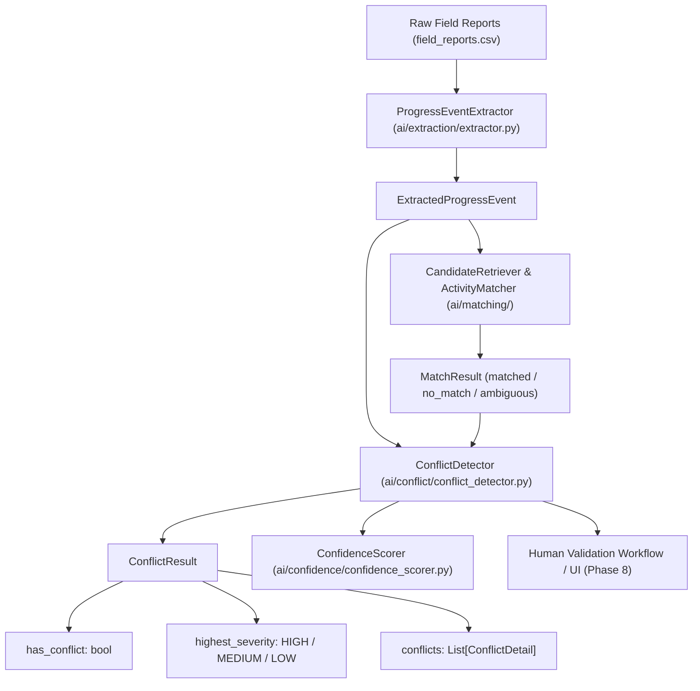

# Implementation Plan - AI/ML Step 7.2: Conflict Detection

Design a minimal, deterministic, offline Conflict Detection component (`ConflictDetector`) for evaluating single field reports and multi-report activity streams to detect progress contradictions, date inversions, status mismatches, defects, and cross-report inconsistencies.

---

## 1. Architectural Separation & Component Workflow



> [!IMPORTANT]
> **Strict Architectural Separation:**
> - **Extraction (Step 5.3)**: Converts raw text to `ExtractedProgressEvent`. Does NOT detect conflicts.
> - **Activity Matching (Step 6.2)**: Ranks L5/L6 activity candidates. Does NOT detect conflicts.
> - **Confidence Scoring (Step 7.1)**: Evaluates decision reliability. Consumes conflict flags as inputs.
> - **Conflict Detection (Step 7.2)**: Evaluates extracted events, schedule activities, and cross-report streams for observable contradictions. Flags conflicts without modifying underlying data.

---

## 2. Conflict Classification & Data Models

### Enums & Dataclasses (`ai/conflict/conflict_detector.py`)

#### A. `ConflictType` Enum
- `STATUS_CONTRADICTION`: Extracted report status conflicts with schedule activity status or another report's status.
- `DATE_INCONSISTENCY`: Extracted dates violate chronological order (`actual_start > actual_finish`) or conflict across reports.
- `PROGRESS_CONTRADICTION`: Extracted progress percentage conflicts with text notes (e.g., 100% progress claimed while text states halted/incomplete).
- `DEFECT_BREAKDOWN`: Site log mentions structural defects, honeycombing, equipment breakdown, or rework requirements.
- `CROSS_REPORT_CONTRADICTION`: Multiple site reports for the same activity present incompatible progress or status claims.

#### B. `ConflictSeverity` Enum
- `HIGH`: Severe defect/breakdown, inverted date logic (`start > finish`), or direct 100% vs 0% status contradiction.
- `MEDIUM`: Partial vs completed status mismatch, progress percentage variance, or schedule activity status discrepancy.
- `LOW`: Minor date discrepancy or missing optional context during conflict evaluation.

#### C. `ConflictDetail` Dataclass
```python
@dataclass
class ConflictDetail:
    conflict_id: str
    conflict_type: ConflictType
    severity: ConflictSeverity
    report_ids: List[str]
    activity_id: Optional[str]
    activity_code: Optional[str]
    description: str
    evidence: List[str]
```

#### D. `ConflictResult` Dataclass
```python
@dataclass
class ConflictResult:
    has_conflict: bool
    highest_severity: Optional[ConflictSeverity]
    conflicts: List[ConflictDetail]
    report_count_evaluated: int
    activity_id: Optional[str]
    summary: str
```

---

## 3. Deterministic Detection Rules

### A. Single Report Evaluation Rules

1. **Rule 1.1: Defect / Breakdown Detection (`DEFECT_BREAKDOWN`)**
   - **Trigger**: `raw_text` or `extracted_text` contains keywords: `honeycombing`, `breakdown`, `flagged`, `repair`, `defect`, `rework`, `halted`, `crack`, `failed inspection`.
   - **Severity**: `HIGH`
   - **Evidence**: Extracted text snippet highlighting the defect/breakdown statement.

2. **Rule 1.2: Progress vs Text Contradiction (`PROGRESS_CONTRADICTION`)**
   - **Trigger**: `progress_value == 100.0` but text mentions `halted`, `incomplete`, `pending repair`, or `partially done`.
   - **Severity**: `HIGH`
   - **Evidence**: Quote showing progress claim vs text caveat.

3. **Rule 1.3: Inverted Date Logic (`DATE_INCONSISTENCY`)**
   - **Trigger**: `actual_start` and `actual_finish` both present, but `actual_start > actual_finish`.
   - **Severity**: `HIGH`
   - **Evidence**: `actual_start (2026-08-10) > actual_finish (2026-08-05)`.

4. **Rule 1.4: Extracted Status vs Schedule Activity Status (`STATUS_CONTRADICTION`)**
   - **Trigger**: `MatchResult` matches activity `ACT-XYZ` with schedule status `Not Started`, but report claims `status == Completed`.
   - **Severity**: `MEDIUM`
   - **Evidence**: `Extracted status 'Completed' vs Schedule baseline status 'Not Started'`.

---

### B. Multi-Report Activity Stream Evaluation Rules

1. **Rule 2.1: Cross-Report Status Regression (`CROSS_REPORT_CONTRADICTION`)**
   - **Trigger**: Report $A$ (Date $T_1$) claims activity `ACT-XYZ` is `Completed`, but Report $B$ (Date $T_2 > T_1$) claims `ACT-XYZ` is `In Progress` or `Not Started`.
   - **Severity**: `HIGH`
   - **Evidence**: `Report REP-001 (2026-08-05) claims Completed; Report REP-032 (2026-08-10) claims In Progress for ACT-XYZ`.

2. **Rule 2.2: Cross-Report Progress Variance (`PROGRESS_CONTRADICTION`)**
   - **Trigger**: Report $A$ claims progress value 100%, Report $B$ for same activity claims progress value 40%.
   - **Severity**: `HIGH`
   - **Evidence**: `Conflicting progress values: 100.0% vs 40.0% across reports REP-001 and REP-033`.

---

### C. Default & Missing Information Handling

- **No Conflict Default**: If no rule is triggered, returns `has_conflict = False`, `highest_severity = None`, `conflicts = []`.
- **Missing Information**: Missing optional fields (`actual_start = None`, `location = None`, `progress_value = None`) are treated as unconfirmed/neutral; they do **NOT** trigger false conflict flags.

---

## 4. Fundamental Flagging Principle: No Auto-Resolution

> [!CAUTION]
> **Strict Non-Resolution Policy:**
> - Conflicts are **FLAGGED ONLY**.
> - `ConflictDetector` will **NEVER** automatically resolve contradictions, overwrite source schedule CSVs, alter activity statuses, or force arbitrary decisions.
> - Structured conflict flags (`ConflictResult`) are preserved for downstream consumption and human validation.

---

## 5. Consumption Pathway for Downstream Modules

1. **Confidence Scoring Integration (Phase 5 / Step 7.1)**:
   - `ConfidenceScorer` consumes `ConflictResult`.
   - If `has_conflict == True` with `highest_severity == HIGH`, confidence score is penalized ($-0.30$) and capped at $\le 0.40$ (`ConfidenceLevel.LOW`).

2. **Human Validation Integration (Phase 8)**:
   - The validation interface reads `ConflictResult.conflicts` to render visual alert badges (e.g. `[HIGH CONFLICT: Defect Flagged]`) allowing site managers to review evidence and resolve disputes manually.

---

## 6. Planned Files to Create

```text
ai/conflict/
├── __init__.py
└── conflict_detector.py

ai/tests/
└── test_conflict_detector.py
```

- **`ai/conflict/__init__.py`**: Export `ConflictDetector`, `ConflictResult`, `ConflictDetail`, `ConflictType`, and `ConflictSeverity`.
- **`ai/conflict/conflict_detector.py`**: Core detection class implementing single-report and multi-report conflict rules.
- **`ai/tests/test_conflict_detector.py`**: Comprehensive unit test suite.

---

## 7. Testing Strategy

Unit tests in `ai/tests/test_conflict_detector.py` will cover:

1. `test_no_conflict`: Valid report with no defects or contradictions returns `has_conflict = False`.
2. `test_status_contradiction`: Extracted status vs schedule status mismatch triggers `STATUS_CONTRADICTION`.
3. `test_date_inconsistency`: `actual_start > actual_finish` triggers `DATE_INCONSISTENCY` with `HIGH` severity.
4. `test_progress_contradiction`: 100% progress claimed alongside text caveats triggers `PROGRESS_CONTRADICTION`.
5. `test_defect_repair_conflict`: Report mentioning `honeycombing` or `breakdown` triggers `DEFECT_BREAKDOWN` with `HIGH` severity.
6. `test_multiple_reports_same_activity`: Multiple reports for same activity with regression trigger `CROSS_REPORT_CONTRADICTION`.
7. `test_missing_partial_information`: Partial report with missing dates/locations does NOT trigger false conflict flags.
8. `test_deterministic_repeated_execution`: Multiple runs on identical inputs produce byte-identical `ConflictResult`.
9. `test_source_datasets_unmodified`: Confirms SHA-256 checksums of `schedules.csv`, `wbs.csv`, `activities.csv`, and `field_reports.csv` remain 100% byte-identical.
