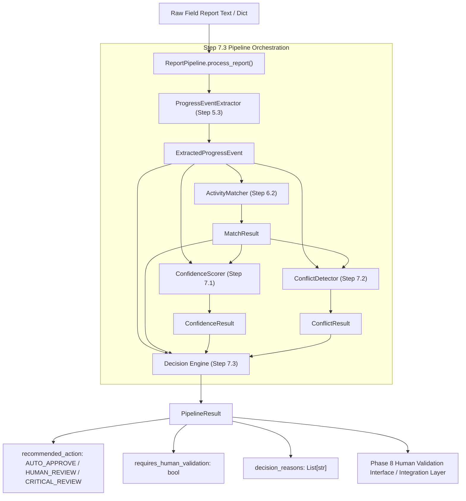

# Implementation Plan - AI/ML Step 7.3: End-to-End Pipeline & Decision Recommendation Engine

Design a lightweight, deterministic, offline Pipeline Orchestrator and Decision Recommendation Engine (`ReportPipeline`) that integrates the completed AI/ML sub-components (Extraction, Activity Matching, Confidence Scoring, and Conflict Detection) into a unified end-to-end processing pipeline for site field reports.

---

## 1. Purpose & Responsibilities of Step 7.3

The primary responsibility of Step 7.3 is to act as the **AI Pipeline Orchestrator and Decision Engine**. It synthesizes the outputs of previous pipeline stages into an actionable, explainable decision recommendation for downstream human validation (Phase 8).

### Key Responsibilities:
1. **Pipeline Orchestration**: Execute the complete processing flow for field report(s):
   - **Step 5.3 (Extraction)**: Convert raw text to `ExtractedProgressEvent`.
   - **Step 6.2 (Activity Matching)**: Match event to L5/L6 schedule activity, producing `MatchResult`.
   - **Step 7.1 (Confidence Scoring)**: Evaluate decision reliability, producing `ConfidenceResult`.
   - **Step 7.2 (Conflict Detection)**: Flag progress/date/status contradictions, producing `ConflictResult`.
2. **Decision Classification**: Categorize report outcome into explicit, explainable review actions:
   - `AUTO_APPROVE`: Match score $\ge 0.70$, Confidence level `HIGH`, `MATCHED` status, zero conflicts, complete extraction.
   - `HUMAN_REVIEW`: Medium confidence, partial extraction, ambiguous activity candidate, or low/medium severity conflict.
   - `CRITICAL_REVIEW`: High-severity conflict (defect/breakdown, date inversion, status regression), `NO_MATCH` status, or low confidence.
3. **Structured Aggregation**: Return a comprehensive `PipelineResult` encapsulating all intermediate stage outputs and decision rationale.

---

## 2. Architectural Placement & Workflow



> [!IMPORTANT]
> **Strict Component Separation:**
> - **Extraction (Step 5.3)**: Text $\rightarrow$ `ExtractedProgressEvent`.
> - **Matching (Step 6.2)**: Event + Schedule $\rightarrow$ `MatchResult`.
> - **Confidence Scoring (Step 7.1)**: Event + Match $\rightarrow$ `ConfidenceResult`.
> - **Conflict Detection (Step 7.2)**: Event + Match + Schedule $\rightarrow$ `ConflictResult`.
> - **Pipeline & Decision Engine (Step 7.3)**: Orchestrates pipeline execution, evaluates combined outputs, and assigns `recommended_action` without re-implementing extraction, matching, confidence, or conflict logic.

---

## 3. Inputs & Outputs

### Inputs
- `raw_report`: `Union[Dict[str, Any], str, ExtractedProgressEvent]` (Raw report dict/string, or pre-extracted event).
- `schedule_target`: `Union[ScheduleDataset, List[ActivityContext], Dict[str, ActivityContext]]` (Schedule dataset/contexts for matching).

### Enums & Dataclasses (`ai/pipeline/report_pipeline.py`)

#### A. `RecommendedAction` Enum
- `AUTO_APPROVE = "auto_approve"`: High confidence, clean match, no conflicts. Safe for automatic schedule updating.
- `HUMAN_REVIEW = "human_review"`: Medium confidence, partial data, ambiguous candidate, or minor conflict. Requires human confirmation.
- `CRITICAL_REVIEW = "critical_review"`: Severe conflict (defect/breakdown, date inversion, status regression) or no matching activity found. Requires manager escalation.

#### B. `PipelineResult` Dataclass
```python
@dataclass
class PipelineResult:
    report_id: str
    recommended_action: RecommendedAction
    requires_human_validation: bool
    decision_reasons: List[str]
    event: ExtractedProgressEvent
    match_result: MatchResult
    confidence_result: ConfidenceResult
    conflict_result: ConflictResult
    processed_at: str
```

---

## 4. Deterministic Decision Rules

The `ReportPipeline` evaluates all stage outputs using deterministic decision rules:

1. **Rule 1: Critical Escalation (`CRITICAL_REVIEW`)**
   - **Trigger**: `conflict_result.highest_severity == ConflictSeverity.HIGH` (e.g. defect/breakdown, inverted dates, cross-report status regression) OR `match_result.match_status == MatchStatus.NO_MATCH` OR `confidence_result.confidence_level == ConfidenceLevel.LOW`.
   - **Action**: `RecommendedAction.CRITICAL_REVIEW`, `requires_human_validation = True`.
   - **Reason**: Flagged high-severity conflict or unresolvable activity match.

2. **Rule 2: Human Validation (`HUMAN_REVIEW`)**
   - **Trigger**: `match_result.match_status == MatchStatus.AMBIGUOUS` OR `confidence_result.confidence_level == ConfidenceLevel.MEDIUM` OR `conflict_result.has_conflict == True` (LOW/MEDIUM severity) OR `event.extraction_status != ExtractionStatus.COMPLETE`.
   - **Action**: `RecommendedAction.HUMAN_REVIEW`, `requires_human_validation = True`.
   - **Reason**: Ambiguous candidate match, partial data, or minor conflict requires site manager review.

3. **Rule 3: Automatic Approval (`AUTO_APPROVE`)**
   - **Trigger**: `match_result.match_status == MatchStatus.MATCHED` AND `confidence_result.confidence_level == ConfidenceLevel.HIGH` AND `conflict_result.has_conflict == False` AND `event.extraction_status == ExtractionStatus.COMPLETE`.
   - **Action**: `RecommendedAction.AUTO_APPROVE`, `requires_human_validation = False`.
   - **Reason**: Complete extraction, unambiguous activity match, high confidence score, and zero detected conflicts.

---

## 5. Handling Missing or Uncertain Information

- **Missing Report Dates / Locations**: Extraction produces `partial` status; `ConfidenceScorer` assigns lower score; `ReportPipeline` routes to `HUMAN_REVIEW`.
- **Unmatched Activities (`NO_MATCH`)**: `ActivityMatcher` returns `NO_MATCH`; `ConfidenceScorer` returns `0.0` confidence; `ReportPipeline` routes to `CRITICAL_REVIEW`.
- **Ambiguous Match Candidates**: `ActivityMatcher` returns `AMBIGUOUS`; `ConfidenceScorer` applies cap ($\le 0.45$); `ReportPipeline` routes to `HUMAN_REVIEW`.

---

## 6. Planned Files to Create

```text
ai/pipeline/
├── __init__.py
└── report_pipeline.py

ai/tests/
└── test_report_pipeline.py
```

- **`ai/pipeline/__init__.py`**: Export `ReportPipeline`, `PipelineResult`, and `RecommendedAction`.
- **`ai/pipeline/report_pipeline.py`**: Core pipeline runner and decision classification engine.
- **`ai/tests/test_report_pipeline.py`**: Unit test suite verifying single/batch report processing, decision routing, determinism, and dataset immutability.

---

## 7. Testing Strategy

Unit tests in `ai/tests/test_report_pipeline.py` will cover:

1. `test_auto_approve_flow`: Complete report + high match score + high confidence + no conflict $\rightarrow$ `AUTO_APPROVE`.
2. `test_human_review_ambiguous_flow`: Ambiguous activity match candidates $\rightarrow$ `HUMAN_REVIEW`.
3. `test_human_review_partial_extraction`: Partial report missing location/dates $\rightarrow$ `HUMAN_REVIEW`.
4. `test_critical_review_defect`: Report mentioning concrete honeycombing/repair $\rightarrow$ `CRITICAL_REVIEW`.
5. `test_critical_review_no_match`: Unrelated report text producing `NO_MATCH` $\rightarrow$ `CRITICAL_REVIEW`.
6. `test_batch_report_processing`: Processing a list of reports returns structured list of `PipelineResult` objects.
7. `test_deterministic_repeated_execution`: Identical runs produce byte-identical/structurally identical `PipelineResult` outputs.
8. `test_source_dataset_immutability`: Confirms SHA-256 hashes of schedule and field report CSV files remain byte-identical.

---

## 8. Explicit Non-Goals

> [!CAUTION]
> **Out of Scope for Step 7.3:**
> - No database writing, ORM integration, or SQL queries.
> - No REST API endpoints or HTTP web servers.
> - No modifications to frontend UI or backend services outside `ai/`.
> - No overwriting or modifying source CSV datasets.
> - No external LLM API calls, cloud embeddings, OCR, or ASR engines.
> - No automatic schedule updates without human validation.

---

## 9. Downstream Consumption Pathway (Phase 8 Human Validation Interface)

The `PipelineResult` output is structured for direct consumption by Phase 8:
- **Auto-Approve Queue**: UI filters results where `recommended_action == AUTO_APPROVE` for batch approval by site engineers.
- **Review Queue**: UI filters results where `recommended_action == HUMAN_REVIEW`, displaying candidate rankings and signal breakdowns.
- **Critical Alert Queue**: UI filters results where `recommended_action == CRITICAL_REVIEW`, rendering high-priority badges and evidence snippets for flagged defects, date inversions, or status regressions.
